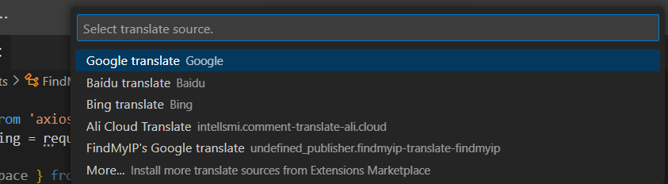

# FindMyIP-Translate README

该插件利用FindMyIP提供的Google翻译 API 为 [comment-translate](https://marketplace.visualstudio.com/items?itemName=intellsmi.comment-translate) 插件提供翻译源。本身不激活，它在选择启用时启动。

## Features

1. 提供翻译能力

## Requirements

请安装 [comment-translate](https://marketplace.visualstudio.com/items?itemName=intellsmi.comment-translate) 使用

## Use

1. 安装完成后，调用 "Change translation source" 接着 "Comment Translate"
   
   

2. 配置 findmyip-translate 插件
3. 直接使用"Comment Translate" 交互模式翻译对应文字

## Extension Settings

无，但后续可能开放自定义API功能

### 0.0.1

Initialize the project, the basic capabilities are implemented